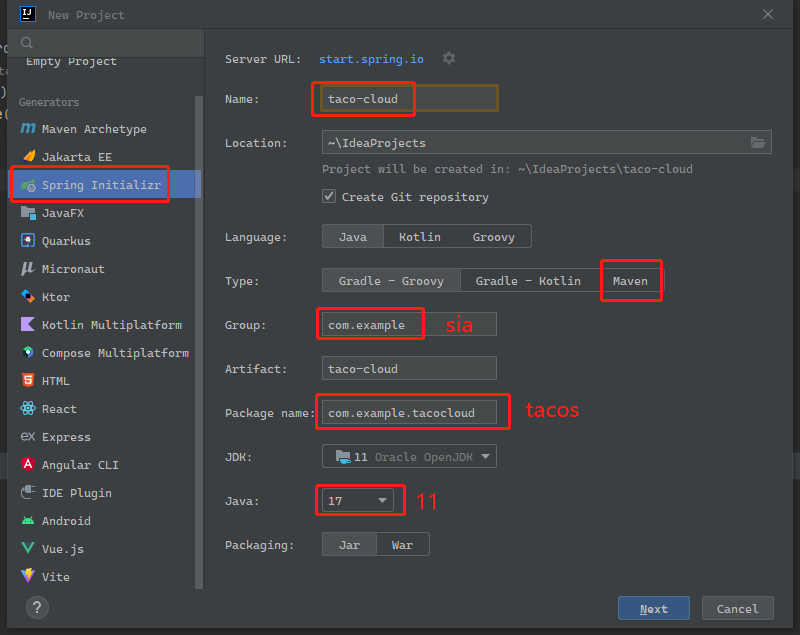
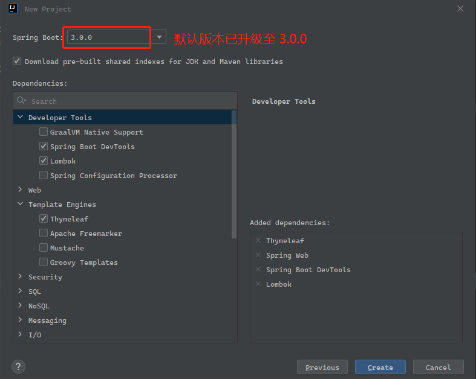
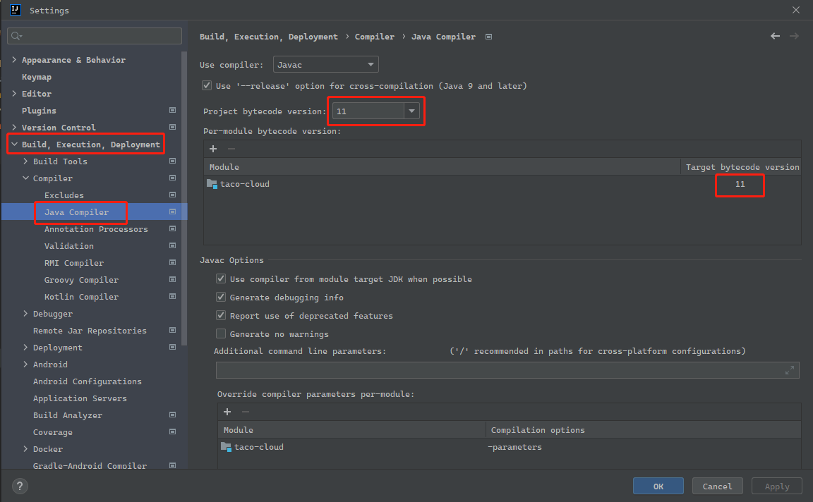
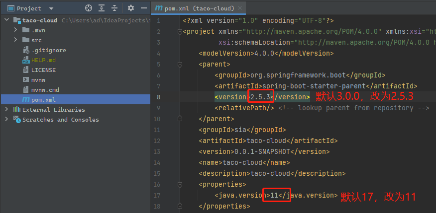
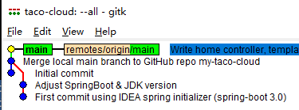
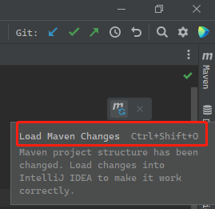
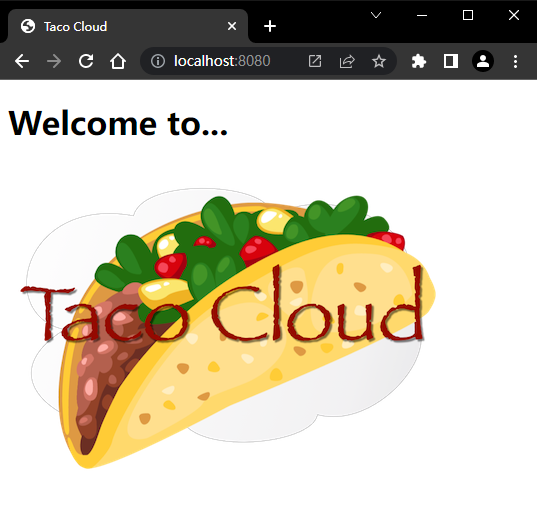

# Ch01 Getting started with Spring（Spring 起步）


## 0.0 前言

`Spring` 及 `SpringBoot` 致力于让 `Java` 应用开发更简单高效已近 20 年了。最初只是为了取代 `EJB 2.x`，现如今已发展到支撑 `Java` 开发的方方面面：数据持久化、安全、集成、云计算……无论是单机应用，还是部署在云端 Kubernetes 集群的容器化的应用，都能见到 `Spring` 的身影。加之 `SpringBoot` 自带的自动配置、构建依赖辅助、运行状态监控等特性，成为一名 `Spring` 开发者可谓恰逢其时。

本书将从一个示例 `Web` 项目开始，介绍 `Spring` 及 `SpringBoot` 提供的强大功能，包括数据处理、应用安全、配置管理，以及后期的项目集成、响应式编程及 `RSocket` 通信协议的具体应用。最后以项目部署的相关配置收尾。


## 0.1 相关资源

- `Manning` 在线阅读：https://livebook.manning.com/book/spring-in-action-sixth-edition
- 代码下载：https://www.manning.com/books/spring-in-action-sixth-edition
- `GitHub`：https://github.com/habuma/spring-in-action-6-samples
- 在线论坛：https://forums.manning.com/forums/spring-in-action-sixth-edition
- `Spring` 官网指南：https://spring.io/guides


**本章要点**

- `Spring` 及 `SpringBoot` 精要
- `Spring` 项目初始化
- `Spring` 全家桶概览

---


## 1.1 何为 Spring

`Spring` 的出现：2002 年 10 月由 *`Wrox`* 出版、*Rod Johnson* 编写的《**Expert One-on-One J2EE Design and Development**》（ISBN: 978-0-764-54385-2，768 页），距今整整二十年了。


## 1.2 初始化 Spring 项目

### 1 `IDEA` 初始化项目

全书示例拟采用最新旗舰版 `IntelliJ IDEA 2022.3` 进行实测，版本信息如下：

```markdown
IntelliJ IDEA 2022.3 (Ultimate Edition)
Build #IU-223.7571.182, built on November 29, 2022
```

`JDK` 版本与原书保持一致：

```powershell
$ java -version
java version "11.0.10" 2021-01-19 LTS
Java(TM) SE Runtime Environment 18.9 (build 11.0.10+8-LTS-162)
Java HotSpot(TM) 64-Bit Server VM 18.9 (build 11.0.10+8-LTS-162, mixed mode)
```

根据附录 `A.2` 提供的安装提示，最新的 `Spring Initializr` 与书中配图（2022年2月出版）略有不同。

实测步骤如下：

1）新建项目：<kbd>Shift</kbd><kbd>Shift</kbd> + <kbd>NEW PROJ</kbd>



2）选择项目依赖：`Spring Boot DevTools`、`Lombok`、`Spring Web`、`Thymeleaf`（Spring Boot 版本先保持默认）



3）指定 IDEA 编译器版本：统一为 `JDK11`：（<kbd>Ctrl</kbd> + <kbd>Alt</kbd> + <kbd>S</kbd>）



4）修改 `pom.xml` 文件：（与书中示例版本保持一致）



5）重新编译项目后，分别执行以下 4 个命令，确保运行正常：

```bash
# path: ./taco-cloud/
$ ./mvnw package
$ java -jar target/taco-cloud-0.0.1-SNAPSHOT.jar`
$ ./mvnw spring-boot:run
$ ./mvnw test
```


### 2 使用 `GitHub` 托管实测代码

所有实测代码尝试在 `GitHub` 进行统一管理，方便管理。

```shell
# 1. 在 `GitHub` 新建仓库 `my-taco-cloud`，只指定开源协议即可，以免冲突
# 2. 在 IDEA 本地项目使用默认的 Git 工具创建本地仓库，提交版本并修改默认分支名（master 改为 main）
$ git branch -m master main
# 3. 添加远程仓库的本地跟踪分支（remotes/origin/main）
$ git remote add origin git@github.com:SafeWinter/my-taco-cloud.git
# 4. 同步远程仓库到本地
$ git fetch
$ git pull origin main
# 5. 合并本地 main 分支到远程 main 分支
$ git merge origin/main --allow-unrelated-histories
# 6. 将本地更新推送至 GitHub，并修改默认的合并注释内容
$ git push --set-upstream origin main
$ git commit --amend
$ git push --force
```

最后使用 `gitk --all` 查看合并后的版本分布：



> **常见问题备忘**
>
> 一、**`mvnw` 与 `mvnw.cmd`**
>
> 初始化项目时位于根路径上的这两个文件，是封装了 `Maven` 的一个工具脚本，使用它们可以不必在本地电脑安装 `Maven`。
>
> 
>
> 二、修改 `pom.xml` 后编译失败：再次编译前，需加载更新内容（快捷键 <kbd>Ctrl</kbd> + <kbd>Shift</kbd> + <kbd>O</kbd>）
>
> 


## 1.3 编写一个 `Spring` 应用

`@SpringBootApplication` 注解加在启动类 `TacoCloudApplication` 上，主要由以下注解组合而成：

- `@SpringBootConfiguration`
- `@EnableAutoConfiguration`
- `@ComponentScan`

启动项目有两个常用命令行：

```bash
# 1. package current project
$ ./mvnw package
# ...
# 2.1. using `java -jar`
$ java -jar target/taco-cloud-0.0.1-SNAPSHOT.jar
# 2.2. using mvnw
$ ./mvnw spring-boot:run
```

以及运行测试命令：

```bash
$ ./mvnw test
```


本节任务是分别创建 `Controller` 类、逻辑视图模板、测试用例，最终实现在正常渲染一个带图片的主页。

### 1 Controller 类：`HomeController.java`

（略）

### 2 视图模板：`home.html`

注意两点：

1. 引入 `Thymeleaf` 风格的命名空间：`<html xmlns="http://www.w3.org/1999/xhtml" xmlns:th="http://www.thymeleaf.org">`
2. `Thymeleaf` 风格的图片标签 `` 的写法：``

### 3 测试用例：`HomeControllerTest.java`

重点关注测试用例的写法！用到了新的注解及函数式编程的编码风格：

```java
@WebMvcTest(HomeController.class)
public class HomeControllerTest {

    @Autowired
    private MockMvc mockMvc;

    @Test
    public void testHomePage() throws Exception {
        mockMvc.perform(get("/"))
                .andExpect(status().isOk())
                .andExpect(view().name("home"))
                .andExpect(content().string(
                        containsString("Welcome to...")));
    }
}
```

其中——

1. `@WebMvcTest` 比默认的 `@SpringBootTest` 注解更具体，用于 `Spring MVC` 应用测试；
2. 模拟发送 `GET` 请求是通过自动装载的 `MockMvc` 对象实现的，需调用 `mockMvc.perform` 方法；
3. `andExpect` 方法函数式地返回 `ResultActions` 对象，以支持链式调用，增强代码的可读性。

示例图片文件 `TacoCloud.png` 从 [随书代码仓库](https://github.com/habuma/spring-in-action-6-samples/blob/main/ch01/taco-cloud/src/main/resources/static/images/TacoCloud.png) 中复制即可。

启动测试命令：

```bash
$ mvnw test
```

实测效果图：




项目运行所需的 `Tomcat` 是 `spring-boot-starter-web` 自动提供的。`Spring Boot` 强大的自动配置功能，不仅可以配置 `Spring` 容器的 `beans` 来启用 `SpringMVC`，还能运行 `Tomcat` 服务器，并且借助 `Thymeleaf` 的模板和视图解析器渲染出 `SpringMVC` 需要的视图，让开发者专注于业务本身，在不刻意关注框架的基础上完成功能开发，让 `Spring` 成为一个无感框架（*frameworkless framework*）。

此外，示例项目还引入了 `spring-boot-devtools` 依赖，主要作用如下：

- 代码更新时自动重启应用
- 页面相关内容更新时自动重新渲染页面（模板、`JavaScript`、`CSS` 等）
- 自动禁用模板引擎的缓存
- 若 H2 数据库可用，项目将使用 H2 控制台进行构建（通过 http://localhost:8080/h2-console 访问）

禁用模板引擎的缓存后，对模板的变更也会使页面重新渲染，在浏览器直接刷新即可。如果连手动刷新也想省略，则需借助第三方插件（如 `LiveReload` 浏览器插件，支持 `Chrome`、`Safari` 及 `Firefox`）

自动重启的本质，在于项目在启用 `devtools` 时，在 `Java` 虚拟机使用了 **两套类加载器**（`class loader`），一个用于项目频繁变更的资源加载（几乎 `src/main/` 下的所有资源）；一个用于鲜有更新的资源（如项目依赖的第三方类库）。该设计在启动项目上节省了一定的时间，但缺陷也很明显——依赖的类库不会自动重启。

> **常见问题：DevTools 在新版 IDEA 中不生效**
>
> 新版 `IDEA` 中的 `DevTools` 需手动设置方可生效，执行以下两步：
>
> 1. <kbd>Ctrl</kbd> + <kbd>Alt</kbd> + <kbd>S</kbd> 打开设置，勾选 <kbd>Build, Execution, Deployment / Compiler</kbd> 下的 **Build project automatically**；
> 2. 勾选 <kbd>Advanced Settings / Compiler</kbd> 下的 **Allow auto-make to start even if developed application is currently running**；


## 1.4 `Spring` 全家桶概览

`Spring` 全家桶成员众多，本节只列举最常用到的几个：

- `Spring` 框架核心：所有 `Spring` 成员的基础——
  - 提供核心容器及依赖注入框架、`JDBCTemplate` 等；
  - 支持 `Spring MVC`——`Spring` 的 `Web` 框架，既可以跳转视图，也可以提供 `REST API` 接口；
  - 支持 `Spring WebFlux` 响应式编程框架；
- `Spring Boot`：
  - 提供各类 `starter` 依赖；
  - 支持自动配置；
  - 提供 `Actuator` 实时监控项目内部运行情况；
  - 灵活的环境属性配置规范；
  - 支持更丰富的测试框架特性；
  - `Spring Boot CLI`：基于 `Groovy` 脚本，整个项目开发都可视为一系列 `Groovy` 脚本的集合，从命令行完成开发；
- `Spring Data`：专注于数据持久化，适配更多类型数据库（关系型、文档型、图论）；
- `Spring Security`：完成认证、授权及 `API` 安全管理等；
- `Spring Integration` & `Spring Batch`：前者负责实时集成，后者专注于批量集成；
- `Spring Cloud`：一组专注于微服务管理的、使用 `Spring` 开发云原生应用程序的项目集合；
- `Spring Native`：借助 `GraalVM` 原生镜像编译器，可将 `Spring` 项目编译成原生的可执行文件，显著提升启动速度，项目也更轻量。


## 小结

- `Spring` 旨在让开发人员轻松应对各种挑战：创建 `Web` 应用、使用数据库、保护应用程序和微服务管理等；
- `Spring Boot` 构建在 `Spring` 之上，通过简化的依赖关系管理、自动配置和运行时监控，使 `Spring` 更加实用；
- 可以使用 `Spring Initializer` 初始化 `Spring` 应用，它是基于 `Web` 的接口工具，支持大多数 `Java` 本地开发；
- `Spring` 应用程序上下文的组件通常称为 `bean`，可以用 `Java` 或 `XML` 显式声明，并通过 `Spring Boot` 的组件扫描或自动配置特性引入；

