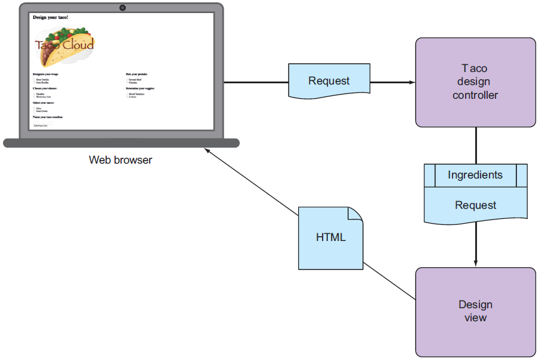
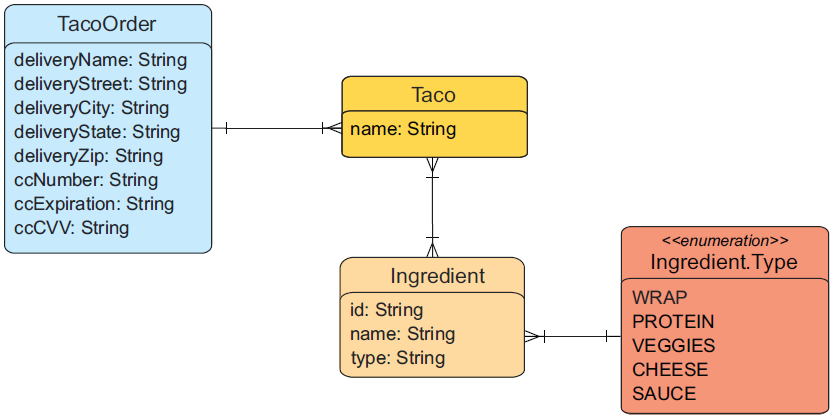
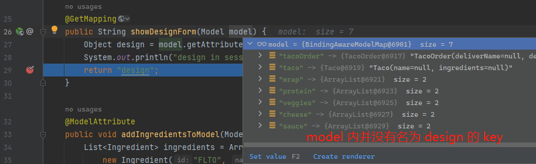
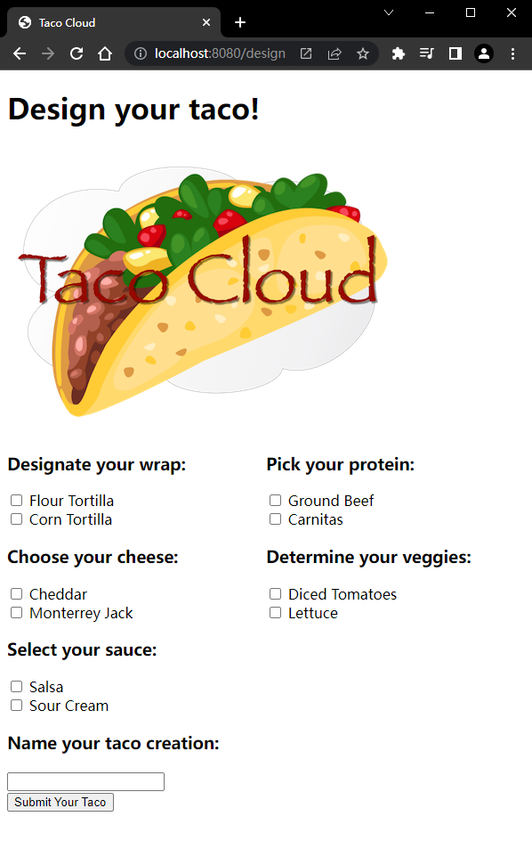

# Ch02 Developing web applications（开发 Web 应用）


**本章要点**

- 在浏览器中展示模型数据
- 处理和验证表单输入
- 选择视图模板库

---

鉴于用户的第一印象来自页面，强化 `Web` 项目的 `UI` 设计就显得尤为重要。


## 2.1 展示信息

本节任务：为用户定制化玉米饼菜谱提供一个设计页面。为此需要实现三个模块：

- 一个包含玉米饼成分（`taco ingredient`）信息的实体类；
- 一个 `SpringMVC` 的控制器类来获取成分信息并发送到视图层；
- 一个视图模板，用于在浏览器渲染各成分信息列表。

各模块之间的联系如图所示：

 


### 1 实体类设计

先来看数据实体类。如图所示：



其中——

- 一个订单类（`TacoOrder`）除了订单自身的基本信息（支付信息、货运信息），还可能包含多个玉米饼菜谱（`Taco`）；
- 一个玉米饼菜谱除了自身名称，还可能包含多种成分（`Ingredient`）；
- 一个菜谱成分（`Ingredient`）有固定的名字、类别及索引 ID，其中类别是一个枚举型；

创建实体类时，配合使用 `Lombok` 注解可大幅减少冗余代码量。它是在编译时生成实体类的 `getter` 与 `setter` 等要素的。

`Lombok` 引入方法只需两步：

1. 添加 `dependency` 节点：

   ```xml
   <dependency>
       <groupId>org.projectlombok</groupId>
       <artifactId>lombok</artifactId>
   </dependency>
   ```

2. 在 `build` 节点配置 maven 打包方式，不构建到正式项目中：（L6-L13）

   ```xml
   <build>
       <plugins>
           <plugin>
               <groupId>org.springframework.boot</groupId>
               <artifactId>spring-boot-maven-plugin</artifactId>
               <configuration>
                   <excludes>
                       <exclude>
                           <groupId>org.projectlombok</groupId>
                           <artifactId>lombok</artifactId>
                       </exclude>
                   </excludes>
               </configuration>
           </plugin>
       </plugins>
   </build>
   ```

先从最底层的 `Ingredient` 实体入手：

```java
package tacos;
import lombok.Data;
@Data
public class Ingredient {
    private final String id;
    private final String name;
    private final Type type;
    public enum Type {
        WRAP, PROTEIN, VEGGIES, CHEESE, SAUCE
    }
}
```

接着是菜谱实体（`Taco`）：

```java
package tacos;
import java.util.List;
import lombok.Data;
@Data
public class Taco {
    private String name;
    private List<Ingredient> ingredients;
}
```

最后是订单实体（`TacoOrder`）：

```java
package tacos;
import java.util.List;
import java.util.ArrayList;
import lombok.Data;
@Data
public class TacoOrder {
    private String deliveryName;
    private String deliveryStreet;
    private String deliveryCity;
    private String deliveryState;
    private String deliveryZip;
    private String ccNumber;
    private String ccExpiration;
    private String ccCVV;
    
    private List<Taco> tacos = new ArrayList<>();
    public void addTaco(Taco taco) {
        this.tacos.add(taco);
    }
}
```

注意，这里的 `tacos` 列表被初始化了。


### 2 Controller 设计

Controller 的作用有两个，要么传递请求给逻辑视图以呈现 `HTML`（浏览器展示），要么直接将数据写入响应体（`RESTful`）。本节以跳转逻辑视图为例，具体需求如下：

1. 该 `Controller` 可以处理请求路径为 `/design` 的 `GET` 请求；
2. 构建一组成分信息（`ingredients`）作数据；
3. 将请求和配料数据提交给视图模板，以 `HTML` 的形式呈现并发送给请求的 `Web` 浏览器。

`DesignTacoController`：

```java
package tacos.web;

@Slf4j
@Controller
@RequestMapping("/design")
@SessionAttributes("tacoOrder")
public class DesignTacoController {

    @ModelAttribute
    public void addIngredientsToModel(Model model) {
        List<Ingredient> ingredients = Arrays.asList(
            new Ingredient("FLTO", "Flour Tortilla", Type.WRAP),
            new Ingredient("COTO", "Corn Tortilla", Type.WRAP),
            new Ingredient("GRBF", "Ground Beef", Type.PROTEIN),
            new Ingredient("CARN", "Carnitas", Type.PROTEIN),
            new Ingredient("TMTO", "Diced Tomatoes", Type.VEGGIES),
            new Ingredient("LETC", "Lettuce", Type.VEGGIES),
            new Ingredient("CHED", "Cheddar", Type.CHEESE),
            new Ingredient("JACK", "Monterrey Jack", Type.CHEESE),
            new Ingredient("SLSA", "Salsa", Type.SAUCE),
            new Ingredient("SRCR", "Sour Cream", Type.SAUCE)
        );

        Type[] types = Ingredient.Type.values();
        for (Type type : types) {
            model.addAttribute(type.toString().toLowerCase(),
                               filterByType(ingredients, type));
        }
    }

    @ModelAttribute(name = "tacoOrder")
    public TacoOrder order() {
        return new TacoOrder();
    }

    @ModelAttribute(name = "taco")
    public Taco taco() {
        return new Taco();
    }

    @GetMapping
    public String showDesignForm() {
        return "design";
    }

    private Iterable<Ingredient> filterByType(
        List<Ingredient> ingredients, Type type) {
        return ingredients
            .stream()
            .filter(x -> x.getType().equals(type))
            .collect(Collectors.toList());
    }

}
```

注意——

1. `@Slf4j` 是 `Lombok` 提供的注解，会在编译时自动注入一个 `log` 日志对象；
2. `@Controller` 用于标识此类为一个控制器类，以便 `Spring` 通过组件扫描发现并作为 `bean` 注入 `Spring` 应用上下文；
3. `@RequestMapping` 用于类上，标识该类可以处理的请求样式，这里表示让 `DesignTacoController` 处理所有以 `/design` 开头的请求；
4. `@SessionAttributes("tacoOrder")` 表示一个稍后创建的 `TacoOrder` 对象会被放入 `session` 会话中，因为 taco 的创建是创建订单的第一步，用户创建的订单需要放到会话层以跨越多个关联请求；
5. `@GetMapping` 是对类上的 `@RequestMapping` 的改良，最终处理的请求路径由二者指定的路径拼接而成，这里为 `GET /design`，由`showDesignForm()` 方法处理该请求；

 `Spring MVC` 中常见的请求注解如下：

|       注解        |          描述           |
| :---------------: | :---------------------: |
| `@RequestMapping` |      通用请求处理       |
|   `@GetMapping`   |  处理 `HTTP GET` 请求   |
|  `@PostMapping`   |  处理 `HTTP POST` 请求  |
|   `@PutMapping`   |  处理 `HTTP PUT` 请求   |
| `@DeleteMapping`  | 处理 `HTTP DELETE` 请求 |
|  `@PatchMapping`  | 处理 `HTTP PATCH` 请求  |

示例中，`@ModelAttribute` 除了像 `order()` 和 `taco()` 方法那样，在注解上指定保存的属性名（`key`），还可以像 `addIngredientsToModel()` 方法那样，引入 `Model` 实例作参数，在方法体内指定不同的 `key`。`Model` 接口是连接 `Controller` 与任何会用到该 `model` 内数据的视图的一个“渡船”，最终所有数据都会随 `GET /design` 请求加载到 `model` 内指定的 `key` 内，供视图层调用。

`showDesignForm` 方法看似只返回了一个逻辑视图，实则同时初始化了一系列数据到 `model` 对象（通过 `@ModelAttribute` 实现）。


> **勘误**
>
> P37 谈到 `showDesignForm()` 方法时说，`Spring` 会将一个 `Taco` 空对象放入 `model` 一个名为 `design` 的键名下。为此，可用断点验证：在创建 `Controller` 类结束后，启动项目并访问 `GET /design` 接口，查看 `model` 内是否存在名为 `design` 的 `key` 即可：（其实没有，证明书中描述有误）
>
> 


### 3 模板视图设计

类似 `home.html`，本节需要创建一个 `Taco` 设计页的模板视图，并利用 `Thymeleaf` 语法渲染 `Controller` 转发的数据。

首先创建模板文件 `/resources/templates/design.html`：

```html
<!DOCTYPE html>
<html xmlns="http://www.w3.org/1999/xhtml"
      xmlns:th="http://www.thymeleaf.org">
    <head>
        <title>Taco Cloud</title>
        <link rel="stylesheet" th:href="@{/styles.css}" />
    </head>
    <body>
        <h1>Design your taco!</h1>
        
        <form method="POST" th:object="${taco}">
            <div class="grid">
                <div class="ingredient-group" id="wraps">
                    <h3>Designate your wrap:</h3>
                    <div th:each="ingredient : ${wrap}">
                        <input th:field="*{ingredients}" type="checkbox" 
                               th:value="${ingredient.id}"/>
                        <span th:text="${ingredient.name}">INGREDIENT</span><br/>
                    </div>
                </div>
                <div class="ingredient-group" id="proteins">
                    <h3>Pick your protein:</h3>
                    <div th:each="ingredient : ${protein}">
                        <input th:field="*{ingredients}" type="checkbox" 
                               th:value="${ingredient.id}"/>
                        <span th:text="${ingredient.name}">INGREDIENT</span><br/>
                    </div>
                </div>
                <div class="ingredient-group" id="cheeses">
                    <h3>Choose your cheese:</h3>
                    <div th:each="ingredient : ${cheese}">
                        <input th:field="*{ingredients}" type="checkbox" 
                               th:value="${ingredient.id}"/>
                        <span th:text="${ingredient.name}">INGREDIENT</span><br/>
                    </div>
                </div>
                <div class="ingredient-group" id="veggies">
                    <h3>Determine your veggies:</h3>
                    <div th:each="ingredient : ${veggies}">
                        <input th:field="*{ingredients}" type="checkbox" 
                               th:value="${ingredient.id}"/>
                        <span th:text="${ingredient.name}">INGREDIENT</span><br/>
                    </div>
                </div>
                <div class="ingredient-group" id="sauces">
                    <h3>Select your sauce:</h3>
                    <div th:each="ingredient : ${sauce}">
                        <input th:field="*{ingredients}" type="checkbox" 
                               th:value="${ingredient.id}"/>
                        <span th:text="${ingredient.name}">INGREDIENT</span><br/>
                    </div>
                </div>
            </div>
            <div>
                <h3>Name your taco creation:</h3>
                <input type="text" th:field="*{name}"/><br/>
                <button>Submit Your Taco</button>
            </div>
        </form>
    </body>
</html>
```

注意 `Thymeleaf` 的几个特殊写法：

- `@{}`：创建一个临时的上下文，指定相对路径，从 `/static/` 开始；
- `${}`：指定一个对象的引用；
- `*{}`：将括号内的内容作为字符串原样输出；
- `th:each="ingredient : ${wrap}"`：类似 `JSP` 中的遍历标签，对集合 `wrap` 进行遍历，当前循环变量为 `ingredient`；

再到官方代码库补充样式文件 `/static/styles.css`：

```css
div.ingredient-group:nth-child(odd) {
	float: left;
	padding-right: 20px;
}
div.ingredient-group:nth-child(even) {
    float: left;
	padding-right: 0;
}
div.ingredient-group {
	width: 50%;
}
.grid:after {
  content: "";
  display: table;
  clear: both;
}
*, *:after, *:before {
  -webkit-box-sizing: border-box;
  -moz-box-sizing: border-box;
  box-sizing: border-box;
}
span.validationError {
	color: red;
}
```

最后运行项目：（<kbd>Shift</kbd> + <kbd>F9</kbd>，然后在浏览器访问：http://localhost:8080/design）



注意到末尾的提交按钮，由于没有创建表单提交逻辑，直接点击会报错。提交逻辑在下一节引入。


## 2.2 处理表单提交


## 2.3 验证表单输入


## 2.4 使用视图控制器


## 2.5 视图模板库选择


## 小结
