# Ch03 Working with data（处理数据）


**本章内容**

- 使用 `Spring` `JdbcTemplate`
- 创建 `Spring Data JDBC Repository`
- 使用 `Spring Data` 声明 `JPA Repository`

本章从传统 `JDBC` 代码入手，依次介绍 `JdbcTemplate`、`Spring Data JDBC` 及 `Spring Data JPA` 如何持久化数据。

---


## 3.1 使用 `JDBC` 读写数据

关系型数据库的地位目前仍无法被撼动。`Spring` 常用的两种数据持久化方式：`Spring JDBC` 与 `Spring JPA`。而 `Spring JDBC` 是对 `JdbcTemplate` 类的进一步强化。本小节先示例 `JdbcTemplate` 的用法，后续两节分别介绍 `Spring Data JDBC` 与 `Spring Data JPA`。

数据持久化的传统写法大致如下：

```java
@Override
public Optional<Ingredient> findById(String id) {
    Connection connection = null;
    PreparedStatement statement = null;
    ResultSet resultSet = null;
    try {
        connection = dataSource.getConnection();
        statement = connection.prepareStatement(
            "select id, name, type from Ingredient where id=?");
        statement.setString(1, id);
        resultSet = statement.executeQuery();
        Ingredient ingredient = null;
        if(resultSet.next()) {
            ingredient = new Ingredient(
                resultSet.getString("id"),
                resultSet.getString("name"),
                Ingredient.Type.valueOf(resultSet.getString("type")));
        } 
        return Optional.of(ingredient);
    } catch (SQLException e) {
        // ??? What should be done here ???
    } finally {
        if (resultSet != null) {
            try {
                resultSet.close();
            } catch (SQLException e) {}
        }
        if (statement != null) {
            try {
                statement.close();
            } catch (SQLException e) {}
        }
        if (connection != null) {
            try {
                connection.close();
            } catch (SQLException e) {}
        }
    }
    return Optional.empty();
}
```

这样写的问题很多：

1. 套路及样板代码过多，容易出错的地方就越多；
2. 与业务代码耦合严重，不便于修改；
3. 真正容易出错的地方 `catch` 块反而不易捕获（连接失败、查询语句写法问题等）；

而使用 `JdbcTemplate` 进行改造，立见高下：

```java
private JdbcTemplate jdbcTemplate;

public Optional<Ingredient> findById(String id) {
    List<Ingredient> results = jdbcTemplate.query(
        "select id, name, type from Ingredient where id=?",
        this::mapRowToIngredient,
        id);
    return results.size() == 0 ?
        Optional.empty() :
        Optional.of(results.get(0));
}
private Ingredient mapRowToIngredient(ResultSet row, int rowNum)
    throws SQLException {
    return new Ingredient(
        row.getString("id"),
        row.getString("name"),
        Ingredient.Type.valueOf(row.getString("type")));
}
```

改造后的主要优势：

1. 样板代码及暴露的节点很少；
2. 代码更贴近业务本身；
3. 无需在 `try-catch` 块显式捕获异常；


接下来按照 `Spring` 提供的 `JdbcTemplate` 类的方式为 `taco-cloud` 项目添加数据持久化模块。

### 1 引入依赖

持久化依赖 `Spring JDBC`，数据库暂时使用 `H2`：

```xml
<dependency>
    <groupId>org.springframework.boot</groupId>
    <artifactId>spring-boot-starter-jdbc</artifactId>
</dependency>
<dependency>
    <groupId>com.h2database</groupId>
    <artifactId>h2</artifactId>
    <scope>runtime</scope>
</dependency>
```

### 2 配置数据源

配置方面，移除默认的 `application.properties` 文件，改用 `application.yml`（可读性、结构性更强）：

```yaml
spring:
  datasource:
    generate-unique-name: false
    name: tacocloud
```

即配置数据库名称为 `tacocloud`。配置后的数据库连接 `URL` 写作：`jdbc:h2:mem:tacocloud`，在 `H2` 控制台查看。

接下来初始化数据表。表设计如下图所示：

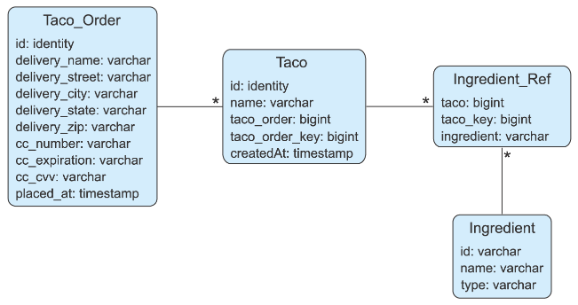

一共四张表，基本情况如下：

|       表名       |                             含义                             |                           新增字段                           |
| :--------------: | :----------------------------------------------------------: | :----------------------------------------------------------: |
|   `Taco_Order`   |                    包含 `taco` 订单的信息                    |             `id`（主键）、`placed_at`（日期型）              |
|      `Taco`      |                  包含具体 `taco` 菜谱的信息                  | `id`（主键）<br/>`create_at`（日期型）<br/>`taco_order`（订单外键）<br/>`taco_order_key`（各菜谱的排序号） |
| `Ingredient_Ref` | 即中间表，包含 `Taco` 中每条记录对应的一条或多条 `Ingredient` 记录 |  `taco_key`（各配料的排序号）<br/>`ingredient`（配料外键）   |
|   `Ingredient`   |                      具体配料的属性信息                      |                            （无）                            |

实体间的关系分析：（按 `DDD` 设计）

- **菜谱** 不能脱离 **订单** 单独存在，因此 **订单** 与 **菜谱** 构成一个 **汇聚关系**：订单为 **汇聚点**，菜谱为 **汇聚源**；
- **配料** 可以独立于某个 **菜谱**，只是每个 **菜谱** 必须有一个 **配料组合**，因此 **配料** 自身构成一个 **汇聚关系**，其汇聚点通过 **中间表** 被 **菜谱** 引用；

有了数据库设计，接下来是编写数据库的表脚本，初始化表数据。`Spring` 默认支持在项目的 `classpath` 下存放初始化脚本：

- `schema.sql`：各对象数据结构脚本；
- `data.sql`：初始数据脚本；

将这两个文件放到 `src/main/resources/` 下即可：

`src/main/resources/schema.sql`：

```sql
create table if not exists Taco_Order (
    id identity,
    delivery_Name varchar(50) not null,
    delivery_Street varchar(50) not null,
    delivery_City varchar(50) not null,
    delivery_State varchar(2) not null,
    delivery_Zip varchar(10) not null,
    cc_number varchar(16) not null,
    cc_expiration varchar(5) not null,
    cc_cvv varchar(3) not null,
    placed_at timestamp not null
);
create table if not exists Taco (
    id identity,
    name varchar(50) not null,
    taco_order bigint not null,
    taco_order_key bigint not null,
    created_at timestamp not null
);
create table if not exists Ingredient_Ref (
    ingredient varchar(4) not null,
    taco bigint not null,
    taco_key bigint not null
);
create table if not exists Ingredient (
    id varchar(4) not null,
    name varchar(25) not null,
    type varchar(10) not null
);
alter table Taco add foreign key (taco_order) references Taco_Order(id);
alter table Ingredient_Ref add foreign key (ingredient) references Ingredient(id);
```

`src/main/resources/data.sql`：

```sql
delete from Ingredient_Ref;
delete from Taco;
delete from Taco_Order;

delete from Ingredient;
insert into Ingredient (id, name, type) values ('FLTO', 'Flour Tortilla', 'WRAP');
insert into Ingredient (id, name, type) values ('COTO', 'Corn Tortilla', 'WRAP');
insert into Ingredient (id, name, type) values ('GRBF', 'Ground Beef', 'PROTEIN');
insert into Ingredient (id, name, type) values ('CARN', 'Carnitas', 'PROTEIN');
insert into Ingredient (id, name, type) values ('TMTO', 'Diced Tomatoes', 'VEGGIES');
insert into Ingredient (id, name, type) values ('LETC', 'Lettuce', 'VEGGIES');
insert into Ingredient (id, name, type) values ('CHED', 'Cheddar', 'CHEESE');
insert into Ingredient (id, name, type) values ('JACK', 'Monterrey Jack', 'CHEESE');
insert into Ingredient (id, name, type) values ('SLSA', 'Salsa', 'SAUCE');
insert into Ingredient (id, name, type) values ('SRCR', 'Sour Cream', 'SAUCE');
```


### 2 修改实体类，增补字段

（1）`Taco.java`：新增 `id`、`createAt`——

```java
@Data
public class Taco {
    private Long id;
    private Date createAt = new Date();

    @NotNull
    @Size(min = 5, message = "Name must be at least 5 characters long")
    private String name;
    @Size(min = 1, message = "You must choose at least 1 ingredient")
    private List<Ingredient> ingredients;
}
```

注意：上一章中，`ingredients` 的校验注解保留了 `@NotNull`，由于 `@Size` 更具体，因此只保留一个。

（2）`TacoOrder.java`：新增 `id`、`placedAt`，同时实现 `Serializable` 接口——

```java
@Data
public class TacoOrder implements Serializable {
    
    public static final long serialVersionUID = 1L;
    private Long id;
    private Date placedAt;
    
    @NotBlank(message="Delivery name is required")
    private String deliveryName;
    @NotBlank(message="Street is required")
    private String deliveryStreet;
    @NotBlank(message="City is required")
    private String deliveryCity;
    @NotBlank(message="State is required")
    private String deliveryState;
    @NotBlank(message="Zip code is required")
    private String deliveryZip;
    @CreditCardNumber(message = "Not a valid credit card number")
    private String ccNumber;
    @Pattern(regexp="^(0[1-9]|1[0-2])([\\/])([2-9][0-9])$",
            message="Must be formatted MM/YY")
    private String ccExpiration;
    @Digits(integer = 3, fraction = 0, message = "Invalid CVV")
    private String ccCVV;
    private List<Taco> tacos = new ArrayList<>();
    public void addTaco(Taco taco) {
        this.tacos.add(taco);
    }
}
```


### 3 定义 JDBC 存储库（repositories）——配料信息

先完成配料信息（`Ingredient`）的入库逻辑。本书中的存储库对象（`Repository`）即一个 `Service` 接口。`Ingredient` 对应的接口类本书叫作 `IngredientRepository`，其功能点一共有三个：

- 全量检索配料列表；
- 根据 `ID` 查单个配料；
- 保存（持久化）一个配料信息；

于是创建持久化接口 `IngredientRepository.java`：（注意包名换到了 `tacos.data` 下）

```java
package tacos.data;

import java.util.Optional;
import tacos.Ingredient;

public interface IngredientRepository {
    Iterable<Ingredient> findAll();
    Optional<Ingredient> findById(String id);
    Ingredient save(Ingredient ingredient);
}
```

然后创建一个实现类 `JdbcIngredientRepository.java`，用构造函数的方式装载 `JdbcTemplate` 并实现各接口方法：

```java
@Repository
public class JdbcIngredientRepository implements IngredientRepository{

    // autowire jdbcTemplate via constructor
    private final JdbcTemplate jdbcTemplate;
    public JdbcIngredientRepository(JdbcTemplate jdbcTemplate) {
        this.jdbcTemplate = jdbcTemplate;
    }

    @Override
    public Iterable<Ingredient> findAll() {
        return jdbcTemplate.query(
                "select id, name, type from Ingredient",
                this::mapRowToIngredient);
    }

    @Override
    public Optional<Ingredient> findById(String id) {
        List<Ingredient> results = jdbcTemplate.query("", this::mapRowToIngredient, id);
        return results.size() == 0 ?
                Optional.empty() :
                Optional.of(results.get(0));
    }

    @Override
    public Ingredient save(Ingredient ingredient) {
        jdbcTemplate.update(
                "insert into Ingredient (id, name, type) values (?, ?, ?)",
                ingredient.getId(),
                ingredient.getName(),
                ingredient.getType().toString());
        return ingredient;
    }

    private Ingredient mapRowToIngredient(ResultSet row, int rowNum) throws SQLException {
        return new Ingredient(
                row.getString("id"),
                row.getString("name"),
                Ingredient.Type.valueOf(row.getString("type")));
    }
}
```

到此，Ingredient 的持久化逻辑实现完毕。可以同步更新上一章 `Controller` 及 `Converter` 的硬编码逻辑：（无关逻辑从略）

```java
package tacos.web;
@Slf4j
@Controller
@RequestMapping("/design")
@SessionAttributes("tacoOrder")
public class DesignTacoController {

    private IngredientRepository ingredientRepo;
    @Autowired
    public DesignTacoController(IngredientRepository ingredientRepo) {
        this.ingredientRepo = ingredientRepo;
    }

    @ModelAttribute
    public void addIngredientsToModel(Model model) {
        Iterable<Ingredient> ingredients = ingredientRepo.findAll();
        Arrays.stream(Ingredient.Type.values())
                .forEach(type -> model.addAttribute(type.toString().toLowerCase(),
                        filterByType(ingredients, type)));
    }

    private Iterable<Ingredient> filterByType(Iterable<Ingredient> ingredients, Type type) {
        return StreamSupport.stream(ingredients.spliterator(), false)
                .filter(x -> x.getType().equals(type))
                .collect(Collectors.toList());
    }
}

```

注意：

1. 第 8 行：`Service` 的注入仍然采用构造函数传参的方式引入；
2. 第 16 行：替换硬编码后，第 19 行相应的参数类型也要调整为 `Iterable<Ingredient>`；
3. 第 23 行：从 `Iterable<Ingredient>` 转换为对应的 `Stream` 流，需要用到 `JDK8` 的内部工具类方法 `StreamSupport.stream`，接收两个参数，`Spliterator` 与并行流开关标记，`false` 表示按串行流转换；

接着再来改造转换工具类 `IngredientByIdConverter.java`：

```java
package tacos.web;

@Component
public class IngredientByIdConverter implements Converter<String, Ingredient> {
    private IngredientRepository ingredientRepo;
    @Autowired
    public IngredientByIdConverter(IngredientRepository ingredientRepo) {
        this.ingredientRepo = ingredientRepo;
    }

    @Override
    public Ingredient convert(String id) {
        return ingredientRepo.findById(id).orElse(null);
    }
}
```


至此，可以在菜谱设计页进行测试。启动项目后，根据控制台提示信息，可以先访问 `H2` 数据库：http://localhost:8080/h2-console/

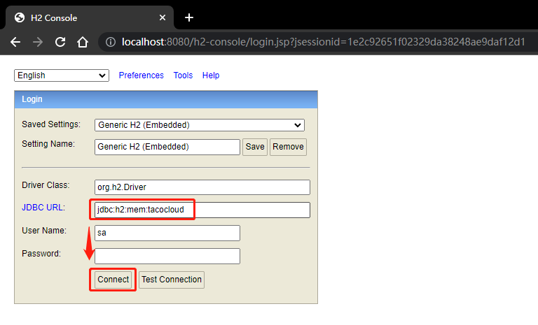

单击 `Connect` 按钮连接数据库，得到如下页面：（连接成功）

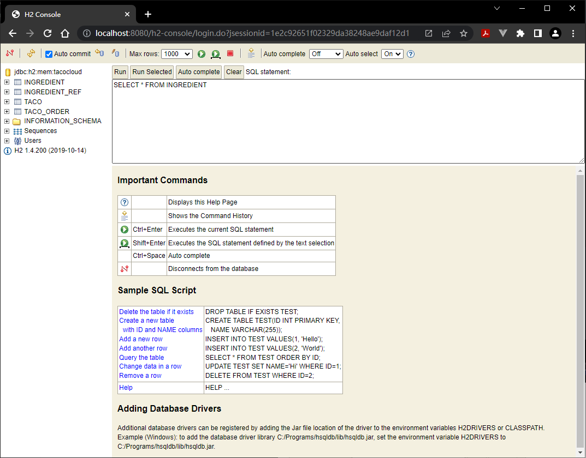

按页面提示执行一个查询语句：`SELECT * FROM INGREDIENT`

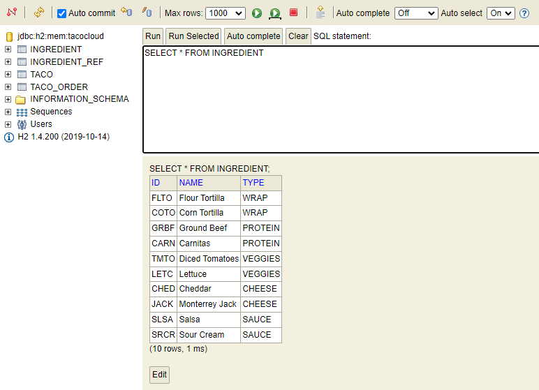

然后测试菜谱设计页能否正常打开：（成功）

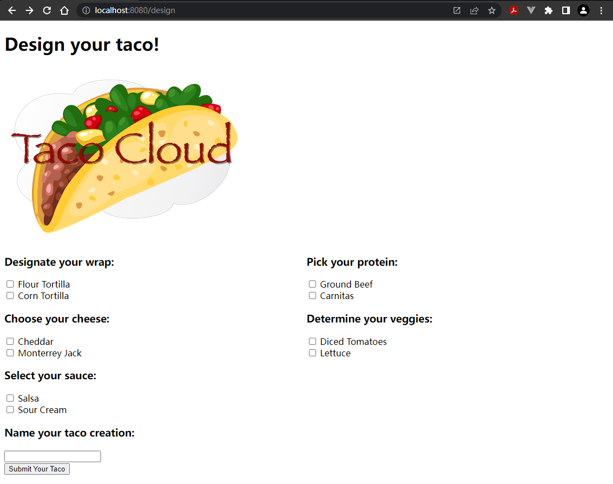

---


### 4 定义 JDBC 存储库（repositories）——订单及菜谱信息

接着加大难度，实现 `TacoOrder` 和 `Taco` 的持久化逻辑。`Taco` 依赖于 `TacoOrder`，因此入库 `TacoOrder` 必须入库对应的一个或多个 `Taco`；入库某个 `Taco` 时，还得同时入库该 `Taco` 关联的一个 **配料组合**，即一个 `Taco` 主键对应多个 `Ingredient` 主键，每个配对即为中间表的一个记录。根据上一节定义的 `Ingredient_Ref` 中间表结构，该表共三个字段——

- `ingredient`：外键，关联配料表 `Ingredient` 的主键ID；
- `taco_order`：定制菜谱时的配料先后顺序；
- `taco`：存放 `Taco` 对象的主键；

首先新增订单存储库接口 `OrderRepository.java`：

```java
package tacos.data;
import java.util.Optional;
import tacos.TacoOrder;
public interface OrderRepository {
    TacoOrder save(TacoOrder order);
}
```

接着创建订单接口实现类 `JdbcOrderRepository`：

```java
package tacos.data;
@Repository
public class JdbcOrderRepository implements OrderRepository {
    private JdbcOperations jdbcOperations;
    public JdbcOrderRepository(JdbcOperations jdbcOperations) {
        this.jdbcOperations = jdbcOperations;
    }

    @Override
    @Transactional
    public TacoOrder save(TacoOrder order) {
        PreparedStatementCreatorFactory pscf =
            new PreparedStatementCreatorFactory(
            "insert into Taco_Order "
            + "(delivery_name, delivery_street, delivery_city, "
            + "delivery_state, delivery_zip, cc_number, "
            + "cc_expiration, cc_cvv, placed_at) "
            + "values (?,?,?,?,?,?,?,?,?)",
            Types.VARCHAR, Types.VARCHAR, Types.VARCHAR,
            Types.VARCHAR, Types.VARCHAR, Types.VARCHAR,
            Types.VARCHAR, Types.VARCHAR, Types.TIMESTAMP
        );
        pscf.setReturnGeneratedKeys(true);

        order.setPlacedAt(new Date());
        PreparedStatementCreator psc =
            pscf.newPreparedStatementCreator(
            Arrays.asList(
                order.getDeliveryName(),
                order.getDeliveryStreet(),
                order.getDeliveryCity(),
                order.getDeliveryState(),
                order.getDeliveryZip(),
                order.getCcNumber(),
                order.getCcExpiration(),
                order.getCcCVV(),
                order.getPlacedAt()));

        GeneratedKeyHolder keyHolder = new GeneratedKeyHolder();
        jdbcOperations.update(psc, keyHolder);
        long orderId = keyHolder.getKey().longValue();
        order.setId(orderId);

        List<Taco> tacos = order.getTacos();
        int i=0;
        for (Taco taco : tacos) {
            saveTaco(orderId, i++, taco);
        }

        return order;
    }
}
```

注意，由于需要拿到实时入库的订单主键 `ID`，需借助 `jdbcOperations` 和 `PreparedStatementCreatorFactory` 以及 `GeneratedKeyHolder`。

第 47 行可效仿订单的实现：

```java
private long saveTaco(Long orderId, int orderKey, Taco taco) {
    taco.setCreatedAt(new Date());
    PreparedStatementCreatorFactory pscf =
        new PreparedStatementCreatorFactory(
        "insert into Taco "
        + "(name, created_at, taco_order, taco_order_key) "
        + "values (?, ?, ?, ?)",
        Types.VARCHAR, Types.TIMESTAMP, Type.LONG, Type.LONG
    );
    pscf.setReturnGeneratedKeys(true);

    PreparedStatementCreator psc =
        pscf.newPreparedStatementCreator(
        Arrays.asList(
            taco.getName(),
            taco.getCreatedAt(),
            orderId,
            orderKey));

    GeneratedKeyHolder keyHolder = new GeneratedKeyHolder();
    jdbcOperations.update(psc, keyHolder);
    long tacoId = keyHolder.getKey().longValue();
    taco.setId(tacoId);

    saveIngredientRefs(tacoId, taco.getIngredients());

    return tacoId;
}
```

第 25 行的 `saveIngredientRefs` 同理：

```java
private void saveIngredientRefs(
    long tacoId, List<IngredientRef> ingredientRefs) {
    int key = 0;
    for (IngredientRef ingredientRef : ingredientRefs) {
        jdbcOperations.update(
            "insert into Ingredient_Ref (ingredient, taco, taco_key) "
            + "values (?, ?, ?)",
            ingredientRef.getIngredient(), tacoId, key++);
    }
}
```

实测时发现，`saveIngredientRefs` 方法签名的第二个参数的类型为 `List<IngredientRef>`；而之前定义的 `taco.getIngredients()` 的类型为 `List<Ingredient>`。究其原因，是作者省略了必要的说明。在之前讨论 `Taco` 与 `Ingredient` 的关系时已经明确：

- `Taco` 依赖 `TacoOrder`：体现在 **定制套餐** 不能脱离一个具体的 **订单**；
- `Ingredient` 不依赖 `Taco`：即便没有 **定制套餐**，各种 **配料** 依然可以存在；
- `IngredientRef` 依赖 `Taco`：体现在 **定制套餐** 必定对应一个 **配料组合**，而 **配料组合** 与 **配料** 才是上文提到的汇聚关系；

加之 `saveIngredientRefs` 的实现逻辑中，配料组合的元素项 `IngredientRef` 只需要提供配料 ID 即可，其余两个字段均可从其他途径获取。因此，配料组合的元素实体只需要一个成员变量来表征 **配料 ID** 即可：

```java
package tacos;
import lombok.Data;
@Data
public class IngredientRef {
    private final String ingredient;
}
```

至此，可以将订单 `Controller` 改造为通过 `OrderRepository` 入库：（注意 `orderRepo` 的装载逻辑及第 16 行的引用）

```java
package tacos.web;
@Controller
@RequestMapping("/orders")
@SessionAttributes("tacoOrder")
public class OrderController {
    private OrderRepository orderRepo;
    public OrderController(OrderRepository orderRepo) {
        this.orderRepo = orderRepo;
    }
    // ...
    @PostMapping
    public String processOrder(@Valid TacoOrder order, Errors errors, SessionStatus sessionStatus) {
        if (errors.hasErrors()) {
            return "orderForm";
        }
        orderRepo.save(order);
        sessionStatus.setComplete();
        return "redirect:/";
    }
}
```

实测效果：

订单表：（入库两条）

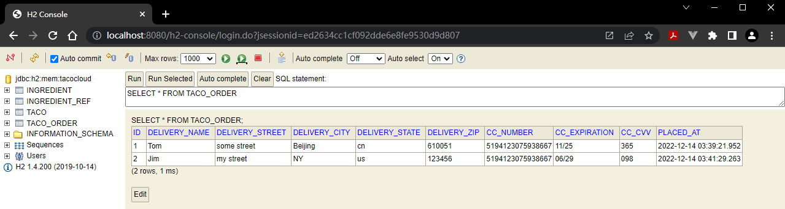

套餐表：（订单 ID 作外键）

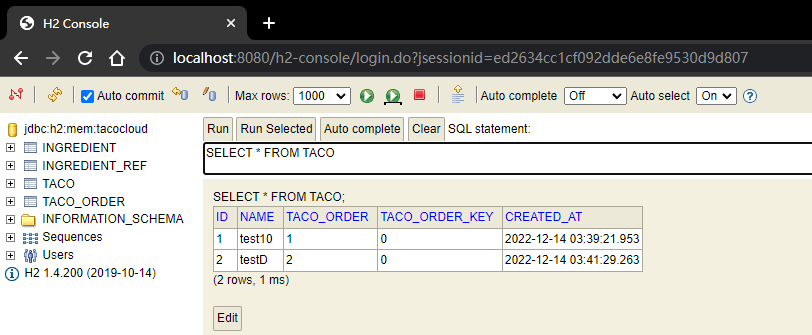


> **拓展**
>
> 本节内容作者没有叙述清楚，存在几个疑点：
>
> - `Taco` 的 `ingredients` 属性为何要变更类型？
> - `IngredientRef` 实体为何明明有三个表字段，却只声明一个成员变量 `ingredient`？
>
> 按照之前的思路也无可厚非，因此决定另起分支，沿用之前的版本实测。
>
> 首先将 `Taco` 类改回 `List<Ingredient>` 型：
>
> ```java
> @Data
> public class Taco {
>     private Long id;
>     private Date createAt = new Date();
>     @NotNull
>     @Size(min = 5, message = "Name must be at least 5 characters long")
>     private String name;
> 
>     @Size(min = 1, message = "You must choose at least 1 ingredient")
>     private List<Ingredient> ingredients;
> }
> ```
>
> 再修改 `JdbcOrderRepository` 持久化 `Ingredient` 集合的逻辑：
>
> ```java
> private void saveIngredientRefs(long tacoId, List<Ingredient> ingredients) {
>     int key = 0;
>     for (Ingredient ingredient : ingredients) {
>         jdbcOperations.update(
>             "insert into Ingredient_Ref (ingredient, taco, taco_key) values (?, ?, ?)",
>             ingredient.getId(), tacoId, key++);
>     }
> }
> ```
>
> 然后删除 `Ingredient_Ref` 实体。
>
> 最后实测：（新增一个订单，包含两个定制 `taco` 套餐）
>
> 第一份 `taco`：
>
> 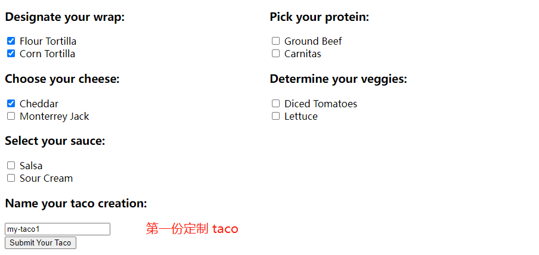
>
> 第二份 `taco`：
>
> 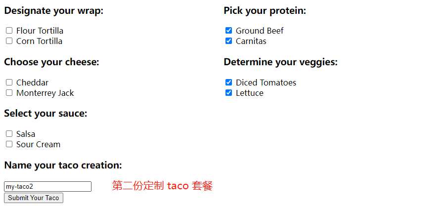
>
> 提交订单 `tacoOrder`：
>
> 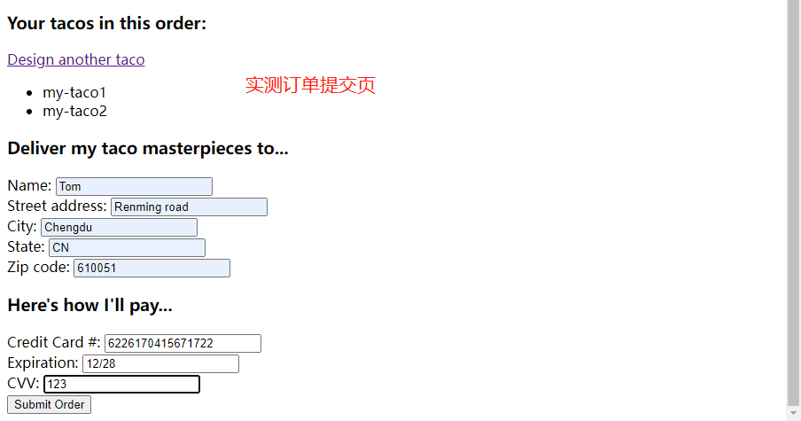
>
> `H2` 数据库入库情况：
>
> 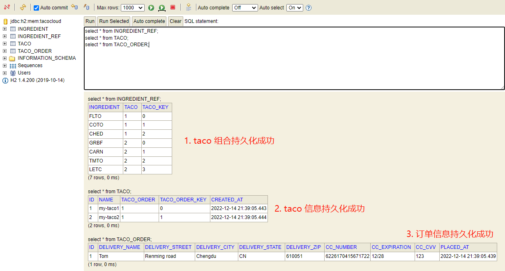


## 3.2 使用 `Spring Data JDBC`


## 3.3 应用 `Spring Data JPA` 持久化数据


## 小结