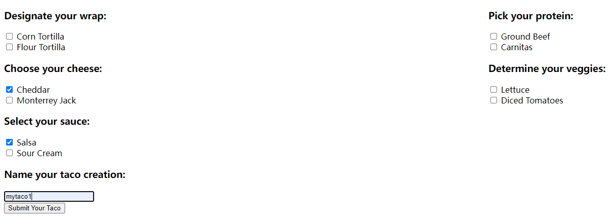
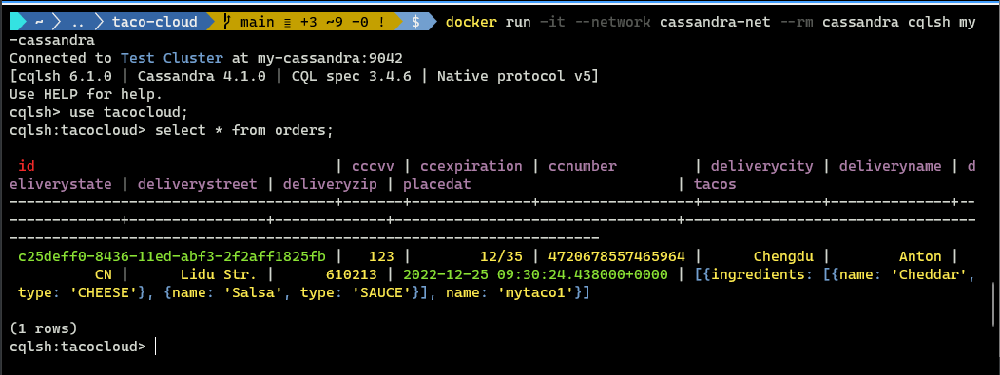

# Ch04 Working with nonrelational data（使用非关系型数据）


本章介绍两个非关系型数据库——`Cassandra` 与 `MongoDB`，在 `Taco-cloud` 项目持久化数据的具体应用。

本章较上一版为新增内容。可惜很多知识点并没有讲透，实测时发现很多问题。


## 4.1. 使用 `Cassandra` 存储

### 1 引入依赖

仅保留 Cassandra 依赖，移除 `Spring Data JPA` 及 `H2` 依赖：

```xml
<dependency>
    <groupId>org.springframework.boot</groupId>
    <artifactId>spring-boot-starter-data-cassandra</artifactId>
</dependency>
```


### 2 初始化 `Docker` 设置

`Cassandra` 需要一个集群环境，通过 `Docker` 实现：

```bash
$ docker network create cassandra-net
$ docker run --name my-cassandra --network cassandra-net -p 9042:9042 -d cassandra:latest
```

启动 `CQL` `shell` 客户端：（`CQL` = **C**assandra **Q**uery **L**anguage）

```bash
$ docker run -it --network cassandra-net --rm cassandra cqlsh my-cassandra
```

创建 `key` 键空间：（`tacocloud`）

```shell
cqlsh> create keyspace tacocloud
   ... with replication={'class':'SimpleStrategy', 'replication_factor':1}
   ... and durable_writes=true;
```

注意，代码中的 `...` 是 `CQL` 命令行自动换行添加的，不是手动输入的。

接着更新配置文件 `application.yml`：

```yaml
spring:
  data:
    cassandra:
      keyspace-name: tacocloud
      schema-action: recreate
      local-datacenter: datacenter1
```

书中写成了 `taco_cloud`，应更正为 `tacocloud`，否则启动报错。

生产环境中还需配置多节点或更换新端口：

```yaml
spring:
  data:
    cassandra:
      keyspace-name: tacocloud
      local-datacenter: datacenter1
      contact-points:
      - casshost-1.tacocloud.com
      - casshost-2.tacocloud.com
      - casshost-3.tacocloud.com
      port: 9043
```

也可设置密码访问：

```yaml
spring:
  data:
    cassandra:
       ...
      username: tacocloud
      password: s3cr3tP455w0rd
```


理解 `Cassandra` 语境下的数据建模：

- `Cassandra` 表可以有任意数量的列，但不是所有的行都必须使用所有这些列。
- `Cassandra` 数据库可以被分割到多个分区中。给定表中的任何行可能由一个或多个分区管理，但在每个分区不太可能包含所有行。
- `Cassandra` 表有两种键：分区键和聚类键。对每一行的分区键执行哈希操作，以确定由哪个分区对该行进行管理。聚类键决定了在分区中维护的那些行的顺序（可能并不出现在查询结果中）。
- `Cassandra` 针对读取操作进行了高度优化。因此，对于高度非规范化的表，或跨多个表冗余数据保存的情况是比较适合的。（例如，客户信息保存在客户数据表，同时也在客户下的订单表中保存一份副本。）


### 3 添加 `Cassandra` 注解

（1）改造 `Ingredient` 实体类：

```java
@Data
@AllArgsConstructor
@NoArgsConstructor(access=AccessLevel.PRIVATE, force=true)
@Table("ingredients")
public class Ingredient {

    @PrimaryKey
    private String id;
    private String name;
    private Type type;

    public enum Type {
        WRAP, PROTEIN, VEGGIES, CHEESE, SAUCE
    }
}
```

（2）改造 `Taco` 实体类：

```java
package tacos;

@Data
@Table("tacos")
public class Taco {

    @PrimaryKeyColumn(type=PrimaryKeyType.PARTITIONED)
    private UUID id = Uuids.timeBased();

    @NotNull
    @Size(min = 5, message = "Name must be at least 5 characters long")
    private String name;

    @PrimaryKeyColumn(type=PrimaryKeyType.CLUSTERED,
                      ordering=Ordering.DESCENDING)
    private Date createdAt = new Date();

    @Size(min=1, message="You must choose at least 1 ingredient")
    @Column("ingredients")
    private List<IngredientUDT> ingredients = new ArrayList<>();

    public void addIngredient(Ingredient ingredient) {
        this.ingredients.add(TacoUDRUtils.toIngredientUDT(ingredient));
    }
}
```

（3）改造 `TacoOrder` 实体类：

```java
@Data
@Table("orders")
public class TacoOrder implements Serializable {

    private static final long serialVersionUID = 1L;
    
    @PrimaryKey
    private UUID id = Uuids.timeBased();

    private Date placedAt = new Date();
    // delivery and credit card properties omitted for brevity's sake

    @Column("tacos")
    private List<TacoUDT> tacos = new ArrayList<>();
    public void addTaco(TacoUDT taco) {
        this.tacos.add(taco);
    }
}
```

注意事项：

1. 类名需添加 `@Table` 注解，括号内是该 `key` 键空间下的表名；
2. `Cassandra` 的主键分为两类：分区键与聚类键，如 `Taco` 实体的 `id` 与 `createdAt`；
3. 聚合关系通过 `@Column` 实现，括号内为列名，但集合元素的类型不再是 `Taco` 或 `Ingredient` 本身，而是基于它们的用户自定义类型（`UDT`，**U**ser-**D**efined **T**ype）；
4. `TacoOrder` 中的 `id` 注解为 `@PrimaryKey`，表示不关心各行的顺序，无论是分区键还是聚类键，都遵循默认的排序规则；
5. `NoSQL` 数据库不是通过外键关联数据，而是通过 `UDT` 将关联的完整数据直接内嵌到某个列中（如 `tacos` 和 `ingredients`），以提高读取速度；


各 `UDT` 类定义如下：

`IngredientUDT.java`：

```java
package tacos;

import lombok.*;
import org.springframework.data.cassandra.core.mapping.UserDefinedType;

@Data
@RequiredArgsConstructor
@NoArgsConstructor(access = AccessLevel.PRIVATE, force = true)
@UserDefinedType("ingredient")
public class IngredientUDT {
    private final String name;
    private final Ingredient.Type type;
}
```

`TacoUDT.java`：

```java
package tacos;

import lombok.Data;
import org.springframework.data.cassandra.core.mapping.UserDefinedType;
import java.util.List;

@Data
@UserDefinedType("taco")
public class TacoUDT {
    private final String name;
    private final List<IngredientUDT> ingredients;
}
```

转换工具类 `TacoUDRUtils.java`：

```java
package tacos;

import java.util.List;
import java.util.stream.Collectors;

public class TacoUDRUtils {

    public static TacoUDT toTacoUDT(Taco taco) {
        return new TacoUDT(taco.getName(), taco.getIngredients());
    }

    public static IngredientUDT toIngredientUDT(Ingredient ingredient) {
        return new IngredientUDT(ingredient.getName(), ingredient.getType());
    }

    public static List<IngredientUDT> toIngredientUDTs(List<Ingredient> ingredients) {
        return ingredients.stream()
                .map(ingredient -> toIngredientUDT(ingredient))
                .collect(Collectors.toList());
    }
}
```


### 4 设置 `Cassandra Repo` 接口

`Repo` 接口与 `Spring Data JPA`、`Spring Data JDBC` 相同，继承 `CrudRepository` 即可：

```java
public interface IngredientRepository extends CrudRepository<Ingredient, String> { 
}
public interface OrderRepository extends CrudRepository<TacoOrder, UUID> {
}
```

注意 `OrderRepository` 的主键类型为 `UUID`。

实测发现，页面提交 `Taco` 到后台时，还需要将 `String` 型的 `Ingredient` 主键转为 `IngredientUDT`（之前为 `Ingredient`）：

```java
@Component
public class IngredientByIdConverter implements Converter<String, IngredientUDT> {
    private final IngredientRepository ingredientRepo;

    @Autowired
    public IngredientByIdConverter(IngredientRepository ingredientRepo) {
        this.ingredientRepo = ingredientRepo;
    }

    @Override
    public IngredientUDT convert(String id) {
        Ingredient target = ingredientRepo.findById(id).orElse(null);
        return new IngredientUDT(target.getName(), target.getType());
    }
}
```


启动项目，存入示例数据：



进入 `CQL Shell` 验证：




## 4.2. 使用 `MongoDB` 存储
